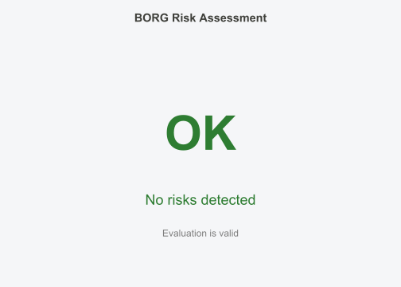

# Quick Start

## Why Your Test Accuracy Might Be Wrong

A model shows 95% accuracy on test data, then drops to 60% in
production. The usual culprit: data leakage.

Leakage happens when information from your test set contaminates
training. Common causes:

- Preprocessing (scaling, PCA) fitted on all data before splitting

- Features derived from the outcome variable

- Same patient/site appearing in both train and test

- Random CV on spatially autocorrelated data

BORG checks for these problems before you compute metrics.

### Basic Usage

``` r

# Create sample data
set.seed(42)
data <- data.frame(
  x1 = rnorm(100),
  x2 = rnorm(100),
  y = rnorm(100)
)

# Define a split
train_idx <- 1:70
test_idx <- 71:100

# Inspect the split
result <- borg_inspect(data, train_idx = train_idx, test_idx = test_idx)
result
#> BorgRisk Assessment
#> ===================
#> 
#> Status: VALID (no hard violations)
#>   Hard violations:  0
#>   Soft inflations:  0
#>   Train indices:    70 rows
#>   Test indices:     30 rows
#>   Inspected at:     2026-03-04 12:49:51
#> 
#> No risks detected.
```

No violations detected. But what if we made a mistake?

``` r

# Accidental overlap in indices
bad_result <- borg_inspect(data, train_idx = 1:60, test_idx = 51:100)
bad_result
#> BorgRisk Assessment
#> ===================
#> 
#> Status: INVALID (hard violations detected)
#>   Hard violations:  1
#>   Soft inflations:  0
#>   Train indices:    60 rows
#>   Test indices:     50 rows
#>   Inspected at:     2026-03-04 12:49:51
#> 
#> --- HARD VIOLATIONS (must fix) ---
#> 
#> [1] index_overlap
#>     Train and test indices overlap (10 shared indices). This invalidates evaluation.
#>     Source: train_idx/test_idx
#>     Affected: 10 indices (first 5: 51, 52, 53, 54, 55)
```

BORG caught the overlap immediately.

### The Main Entry Point: `borg()`

For most workflows,
[`borg()`](https://gillescolling.com/BORG/reference/borg.md) is all you
need. It handles two modes:

#### Mode 1: Diagnose Data Dependencies

When you have structured data (spatial coordinates, time column, or
groups), BORG diagnoses dependencies and generates appropriate CV folds:

``` r

# Spatial data with coordinates
set.seed(42)
spatial_data <- data.frame(
  lon = runif(200, -10, 10),
  lat = runif(200, -10, 10),
  elevation = rnorm(200, 500, 100),
  response = rnorm(200)
)

# Let BORG diagnose and create CV folds
result <- borg(spatial_data, coords = c("lon", "lat"), target = "response")
result
#> BORG Result
#> ===========
#> 
#> Dependency:  NONE (none severity)
#> Strategy:    random
#> Folds:       5
#> 
#> Fold sizes:  train 160-160, test 40-40
#> 
#> Access components:
#>   $diagnosis  - BorgDiagnosis object
#>   $folds      - List of train/test index vectors
#>   $cv         - Full borg_cv object
```

BORG detected spatial structure and recommended spatial block CV instead
of random CV.

#### Mode 2: Validate Existing Splits

When you have your own train/test indices, BORG validates them:

``` r

# Validate a manual split
risk <- borg(spatial_data, train_idx = 1:150, test_idx = 151:200)
risk
#> BorgRisk Assessment
#> ===================
#> 
#> Status: VALID (no hard violations)
#>   Hard violations:  0
#>   Soft inflations:  0
#>   Train indices:    150 rows
#>   Test indices:     50 rows
#>   Inspected at:     2026-03-04 12:49:51
#> 
#> No risks detected.
```

### Visualizing Results

Use standard R [`plot()`](https://rdrr.io/r/graphics/plot.default.html)
and [`summary()`](https://rdrr.io/r/base/summary.html):

``` r

# Plot the risk assessment
plot(risk)
```



``` r

# Generate methods text for publications
summary(result)
#> 
#> Model performance was evaluated using random k-fold cross-validation (k = 5). Cross-validation strategy was determined using the BORG package (version 0.2.3) for R.
```

### Data Dependency Types

BORG handles three types of data dependencies:

#### Spatial Autocorrelation

Points close together tend to have similar values. Random CV
underestimates error because train and test points are intermixed.

``` r

result_spatial <- borg(spatial_data, coords = c("lon", "lat"), target = "response")
result_spatial$diagnosis@recommended_cv
#> [1] "random"
```

#### Temporal Autocorrelation

Sequential observations are correlated. Future data must not leak into
past predictions.

``` r

temporal_data <- data.frame(
  date = seq(as.Date("2020-01-01"), by = "day", length.out = 200),
  value = cumsum(rnorm(200))
)

result_temporal <- borg(temporal_data, time = "date", target = "value")
result_temporal$diagnosis@recommended_cv
#> [1] "temporal_block"
```

#### Clustered/Grouped Data

Observations within groups (patients, sites, species) are more similar
than between groups.

``` r

grouped_data <- data.frame(
  site = rep(1:20, each = 10),
  measurement = rnorm(200)
)

result_grouped <- borg(grouped_data, groups = "site", target = "measurement")
result_grouped$diagnosis@recommended_cv
#> [1] "random"
```

### Risk Categories

BORG classifies risks into two categories:

#### Hard Violations (Evaluation Invalid)

These invalidate your results completely:

| Risk                    | Description                              |
|-------------------------|------------------------------------------|
| `index_overlap`         | Same row in both train and test          |
| `duplicate_rows`        | Identical observations in train and test |
| `target_leakage`        | Feature with                             |
| `group_leakage`         | Same group in train and test             |
| `temporal_leakage`      | Test data predates training data         |
| `preprocessing_leakage` | Scaler/PCA fitted on full data           |

#### Soft Inflation (Results Biased)

These inflate metrics but don’t completely invalidate:

| Risk                  | Description                    |
|-----------------------|--------------------------------|
| `proxy_leakage`       | Feature with                   |
| `spatial_proximity`   | Test points too close to train |
| `random_cv_inflation` | Random CV on dependent data    |

### Detecting Specific Leakage Types

#### Target Leakage

Features derived from the outcome:

``` r

# Simulate target leakage
leaky_data <- data.frame(
  x = rnorm(100),
  leaked_feature = rnorm(100),  # Will be made leaky
  outcome = rnorm(100)
)
# Make leaked_feature highly correlated with outcome
leaky_data$leaked_feature <- leaky_data$outcome + rnorm(100, sd = 0.05)

result <- borg_inspect(leaky_data, train_idx = 1:70, test_idx = 71:100,
                       target = "outcome")
result
#> BorgRisk Assessment
#> ===================
#> 
#> Status: INVALID (hard violations detected)
#>   Hard violations:  1
#>   Soft inflations:  0
#>   Train indices:    70 rows
#>   Test indices:     30 rows
#>   Inspected at:     2026-03-04 12:49:51
#> 
#> --- HARD VIOLATIONS (must fix) ---
#> 
#> [1] target_leakage_direct
#>     Feature 'leaked_feature' has correlation 0.998 with target 'outcome'. Likely derived from outcome.
#>     Source: data.frame$leaked_feature
```

#### Group Leakage

Same entity in train and test:

``` r

# Simulate clinical data with patient IDs
clinical_data <- data.frame(
  patient_id = rep(1:10, each = 10),
  visit = rep(1:10, times = 10),
  measurement = rnorm(100)
)

# Random split ignoring patients (BAD)
set.seed(123)
all_idx <- sample(100)
train_idx <- all_idx[1:70]
test_idx <- all_idx[71:100]

# Check for group leakage
result <- borg_inspect(clinical_data, train_idx = train_idx, test_idx = test_idx,
                       groups = "patient_id")
result
#> BorgRisk Assessment
#> ===================
#> 
#> Status: VALID (no hard violations)
#>   Hard violations:  0
#>   Soft inflations:  0
#>   Train indices:    70 rows
#>   Test indices:     30 rows
#>   Inspected at:     2026-03-04 12:49:51
#> 
#> No risks detected.
```

### Working with CV Folds

Access the generated folds directly:

``` r

result <- borg(spatial_data, coords = c("lon", "lat"), target = "response", v = 5)

# Number of folds
length(result$folds)
#> [1] 5

# First fold's train/test sizes
cat("Fold 1 - Train:", length(result$folds[[1]]$train),
    "Test:", length(result$folds[[1]]$test), "\n")
#> Fold 1 - Train: 160 Test: 40
```

### Exporting Results

For reproducibility, export validation certificates:

``` r

# Create a certificate
cert <- borg_certificate(result$diagnosis, data = spatial_data)
cert
#> BORG Validation Certificate
#> ===========================
#> 
#> Generated: 2026-03-04T12:49:51+0100
#> BORG version: 0.2.3
#> Validation: PASSED
#> 
#> Data Characteristics:
#>   Observations: 200
#>   Features: 4
#>   Hash: sig:200|4|lon,lat,elevation,response
#> 
#> Dependency Diagnosis:
#>   Type: NONE
#>   Severity: none
#>   Recommended CV: random
#> 
#>   Spatial Analysis:
#>     Moran's I: 0.000 (p = 0.6171)
#>     Range: 2.0
#> 
#>   Temporal Analysis:
#> 
#>   Clustered Analysis:
```

``` r

# Export to file
borg_export(result$diagnosis, spatial_data, "validation.yaml")
borg_export(result$diagnosis, spatial_data, "validation.json")
```

### Interface Summary

| Function | Purpose |
|----|----|
| [`borg()`](https://gillescolling.com/BORG/reference/borg.md) | Main entry point - diagnose data or validate splits |
| [`borg_inspect()`](https://gillescolling.com/BORG/reference/borg_inspect.md) | Detailed inspection of train/test split |
| [`borg_diagnose()`](https://gillescolling.com/BORG/reference/borg_diagnose.md) | Analyze data dependencies only |
| [`plot()`](https://rdrr.io/r/graphics/plot.default.html) | Visualize results |
| [`summary()`](https://rdrr.io/r/base/summary.html) | Generate methods text |
| [`borg_certificate()`](https://gillescolling.com/BORG/reference/borg_certificate.md) | Create validation certificate |
| [`borg_export()`](https://gillescolling.com/BORG/reference/borg_export.md) | Export certificate to YAML/JSON |

### See Also

- [`vignette("risk-taxonomy")`](https://gillescolling.com/BORG/articles/risk-taxonomy.md) -
  Complete catalog of detectable risks

- [`vignette("frameworks")`](https://gillescolling.com/BORG/articles/frameworks.md) -
  Integration with caret, tidymodels, mlr3
